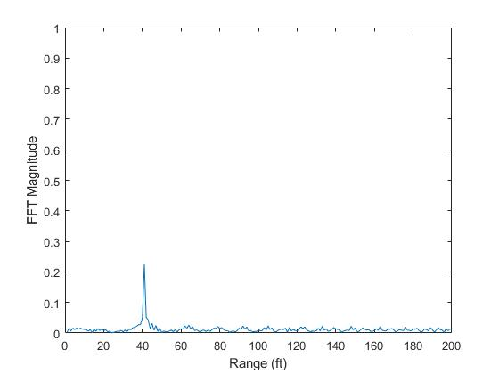

# Radar Target Generation And Detection

## Software Used
1. MATLAB 2019a

## Miniproject Output
### Testing the MATLAB Toolbox - Aotomated Driving Car
- Clustering
- Kalman Filter

## Project Output
### Singnal Processing and Filtering 2D Radar Data

## Project Description
Given Radar Specifications 
- Frequency of operation = 77GHz
- Max Range = 200m
- Range Resolution = 1 m
- Max Velocity = 100 m/s

1. Using the given system requirements, design a FMCW waveform. Find its Bandwidth (B), chirp time (Tchirp) and slope of the chirp.
2. A beat signal is generated by mixing the transmitted and the recieved signal.
3. Range FFT is implemented, it gives the correct range of the traget with an error margin of +/- 10 meters.
4. Additionally, 2D FFT is implemented to get a Range Doppler Map.
5. 2D CFAR is used on the output of 2D FFT operation

## 2DCFAR 
1. Around each cell of the range doppler map or RDM of size (Nr/2)xNd, Gr, Gd, Tr and Td number of cells are assumed to be gaurd and training cells to estimate the threshold noise levels. Gr - no of gaurd cells in the range direction, Tr - no of training cells in the doppler direction
2. The gaurd and training cells for the cell of interest in the region bounded by [Tr + Gr + 1, Td + Gd + 1], [Tr + Gr + 1, Nd-(Td + Gd)], [Nr/2 - (Tr + Gr), Nd - (Td + Gd)] and [Nr/2 - (Tr + Gr), Td + Gd + 1] are used in the cfar algorithm. Rest of the cells' threshold are masked.
3. For cells in between, steps similar to 1dcfar assignment are adopted to achieve 2dcfar threshold.

- For each 2D window under examination, I have taken an average of the training elements by converting them from dB to power. And ignored the elements that are within the guard window.
- The average is converted back to the unitless dB
- An offset SNR threshold is set. (expected Signal-To-Noise ratio of the environment).
- If the SNR threshold in dB is larger than the average taken by the elements, threshold is set to be 1, else 0.

4. Corresponding to each cell in the RDM, a respective threshold noise value is [0 or 1] is assigned. For the cells not processed in the cfar algorithm, I have assigned a value of 0 to ignore the cells at those locations. 
5. The values for the hyperparamters after experimentation are taken as
* Td = 10
* Tr = 10
* Gr = 5
* Gd = 5
* offset = 8
